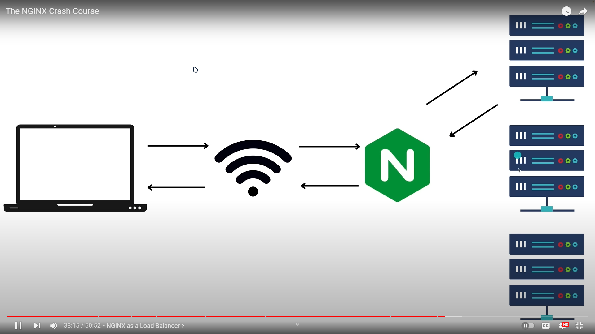

# the nginx crash course **(。_。)**   `(＠_＠;)`

## install it as any other app, (docker has some different init)

course URI is [here:](https://youtu.be/7VAI73roXaY)

nginx syntax:

context {
  directives => key value;
}

---

## serving static content:-

html, css, images
because we're dealing with http responses, we need an http context, and an events one:

```conf
http {
  server {
    listen 8080;
    root dir/public; # file path, as we do with express.static()
  }
}
events {}
```

## mime types, with nginx:-

we've created a css file, other than the simple html we created and connected above, and we link the css within html, we need to serve the css type
out browser response headers res with plain content type, before we change it with:

above server context, we add types context as

```conf
http {
  types {
    text/css    css;
    text/html    html;
  }
  server {
    listen 8080;
    root dir/public;
  }
}
events {}
```

We reload nginx page served as a server with this command, {mentor did it in Mac}:

```sh
nginx -s reload
# and in his browser, he used the hard reload with {cmd shift r} MAC ⌨️
```

When mentor installed nginx, it came with many files, not only the conf one, one of them is `mime.types`, that serves MIME, and instead of manually adding each as code above, it handles that, it has needed types, so we only invoke it with:

```conf
http {
  include mime.types;
  server {
    listen 8080;
    root dir/public;
  }
}
events {}
```

## LOCATION BLOCK/context

this serves endpoints, page location, as (`'/'`, Fn) in express: the api path!

```conf
# initially, he created a separate file: fruits, then used this:
http {
  include mime.types;
  server {
    listen 8080;
    root dir/public;

    location /fruits {
      root dir/public; so it grabs fruits without re-adding it inside it. or it will consider it: fruits/fruits
    }
      ; if we wanna add an endpoint with a different DIR name we use alias instead of root, to tell it that we don't wanna append location to our Path, do:
    location /crabs {
      alias dir/public/fruits; same fruits files🔴
    }
  }
}
events {}
```

If we use other than index.html to be working in a location context, it'll return forbidden 403 code. so we need to make the location as:

```conf
try_files /vegetables/veggies.html ; this directive tells nginx to search for other than index.html, and we specify what directories to try!
; to become as:
http {
  include mime.types;
  server {
    listen 8080;
    root dir/public;

    location /fruits {
      root dir/public;
    }
    location /crabs {
      alias dir/public/fruits;
    }
    location /vegetables {
      root dir/public;
      try_files /vegetables/veggies.html /index.html =404; 2nd opt is in /app not vegetables🔴
      ;  /index.html; gives the other option to it!
      ; =404 tells if not exists throw not found page!
    }
  }
}
events {}
```

We can have regExp to other location context!
as:

```conf
location ~* /count/[0-9] {
    root dir/public;
    try_files /index.html =404;
  }
; so, when client adds address/count/n it'll do inside directive
; ~* invokes regular expression
```

## 33:35 redirects & rewrites

We wanna redirect users, something like when they go to crabs, we redirect them to fruits!

Use this syntax:

```conf
location /crops {
  return 307 /fruits
}
; 307 is http code for redirection, that moves client's url to tended location, although we can let path as is, but send fruits data, as:

; say we have a location /number/[0-9] to forward to /count/[0-9] that we used before! and we wanna let number as is but the functionality to be in count, this case is called rewriting, not redirecting:
rewrite ^/number/(\w+) count/$1
; so (\w+) => $1
```

## load balancing‼️

 this works in nginx with load balancing algorithms!

Mentor uses docker to use containers as we did in the 5 hours course.

after 37m I don't need anything from this video!

---

## important about nginx with Sahn Lam and docks

**Reverse proxy**{nginx is 1 of 'em}:

1. protects a web site
2. load balancing
3. caching
4. handles SSL encryption

**Reverse proxy** can handle caching for frequently used content!

SSL encryption, by handling ssl handshake only once, it can less loss of computation!

modern websites have many reverse proxy layers, as meta, google, amazon, apple, netflix, and stripe.

1. first layer could be an **edge service** as **cloud flare**
2. 2nd layer could be an api gateway/load balancer

Many cloud providers combine these two layers into an `ingress service`.
